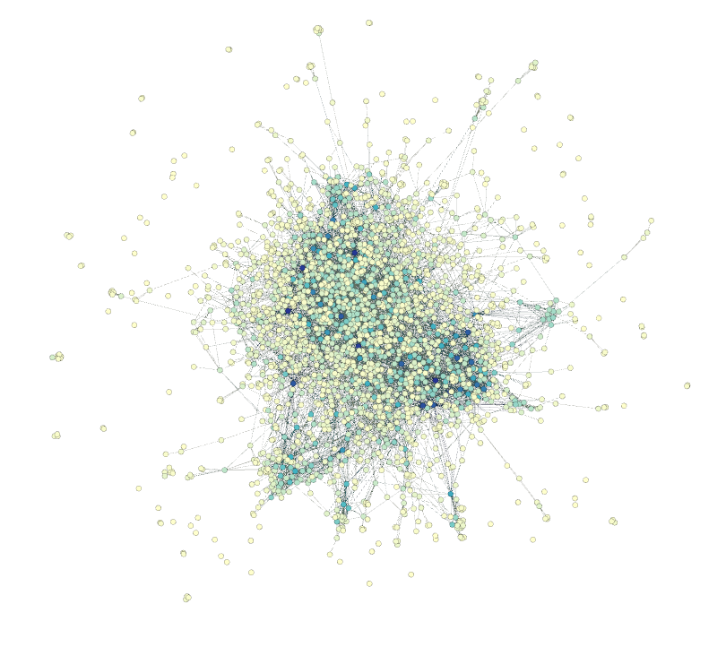

# Graphical analysis of protein interactions in yeast

The aim of this practical is to examine some uses of graphical analysis in a biological setting. The analyses are identical to those demonstrated in the London Tube Graph examples in the introduction to systems biology lecture.

The approaches we saw in the London Tube Map example involved visual examination of the coloured nodes and edges of the graph. For large biological (or other) graphs, this is not feasible. The graph we will be looking at today is shown here.



Questions to be answered for the assignment are written in **bold**.

### Programming language

The practical uses the [Go programming language](https://golang.org/). Go is a statically typed, compiled language, but we will be using it through an interactive environment called Jupyter. This tries to make Go behave as an interpretted language, and this may cause some problems at some stages. If you have any problems, please ask the demonstrators for help.

### Setting up the package imports

Go modularises code into packages (much the same way as other languages, though diffferent languages will use different terms for the same concept). Go packages must be imported before they can be used. In a compiled Go program this *must* happen at the beginning of a source code file, though in jupyter, this is not strictly necessary.

The packages that we will use are for printing, `"fmt"`, logging errors, `"log"`, and performing the graph analyses, `"github.com/kortschak/graphprac"`. The first two packages are provided with the language and the last is a small package that wraps graph routines made available through the graph packages of the https://gonum.org project, [`graph/...`](https://godoc.org/gonum.org/v1/gonum/graph/).


```go
import (
    "fmt"
    "log"

    "github.com/kortschak/graphprac"
)
```

The documentation for the `"github.com/kortschak/graphprac"` package is available from the godoc.org website: http://godoc.org/github.com/kortschak/graphprac. You can click on links on the documentation page to see the source of the functions and to link to the definitions of types and externally provided functions. This is an excellent way to get to understand the code.

The routines wrapped by the `"github.com/kortschak/graphprac"` are in [`graph/network`](https://godoc.org/gonum.org/v1/gonum/graph/network) and [`graph/community`](https://godoc.org/gonum.org/v1/gonum/graph/community).

### Read in a graph

The graph is from a [data set](http://vlado.fmf.uni-lj.si/pub/networks/data/bio/Yeast/Yeast.htm) used in an analysis of topological structure in the yeast protein interaction network (DOI:[10.1093/nar/gkg340](https://doi.org/10.1093/nar/gkg340)).


```go
infile := "YeastL.dot"
```


```go
g, err := graphprac.NewGraph(infile)
if err != nil {
    log.Fatalf("failed to read graph: %v", err)
}
fmt.Printf("G has %d nodes and %d edges.\n", len(g.Nodes()), len(g.Edges()))
```


    G has 2361 nodes and 6646 edges.


**Notice that the number of nodes agrees with the data set summary linked above, but the number of edges disagrees. Suggest why this might be.**

### Examining the nodes

There is no `head` function in Go (we could write one, but the code is short, so there is no need).

The following code loops over the first 10 elements of the nodes slice (essentially and array - there are differences in Go, but that is not important here) and prints out the node value stored in `n`.

Note that running this multiple times will result in different sets of nodes being printed as the nodes returned by `g.Nodes()` are selected in a random order, so the first ten will differ. Try this out.

**Why is it not important that a node list be returned in a specific order?**


```go
for _, n := range g.Nodes()[:10] {
    fmt.Println(n)
}
```


    &{1009 "PUB1" [{desc "major polyadenylated RNA-binding protein of nucleus and cytoplasm"}]}
    &{1095 "SAP30" [{desc "subunit of the histone deacetylase B complex"}]}
    &{1411 "YNL207w" [{desc "similarity to M.jannaschii hypothetical protein MJ1073"}]}
    &{799 "SWI3" [{desc "transcription regulatory protein"}]}
    &{821 "YPL013c" [{desc "strong similarity to N.crassa mitochondrial ribosomal protein S24"}]}
    &{1131 "SAC2" [{desc "suppressor of actin mutation"}]}
    &{1464 "YOL093w" [{desc "similarity to C.elegans hypothetical protein F25H8.1"}]}
    &{2155 "YIL113w" [{desc "strong similarity to dual-specificity phosphatase MSG5P"}]}
    &{891 "NUP159" [{desc "nuclear pore protein"}]}
    &{1013 "PUS1" [{desc "pseudouridine synthase 1"}]}


### Network analysis

We are going to look at nodes that have a high connectivity or potential for information flow through the network.

Two measure that we can use to do this (*very roughly*) are node betweenness centrality and PageRank.

The routines provided in the `graphprac` package write their analysis results into the graph that is provided as a parameter. This is not how we normally do this kind of analysis, but it make the practical simpler.

The writing into the graph is done via a set of attributes that have names that can be queried using the functions in the package.

**How can an attribute be queried? Use an example to demonstrate.**

The first analysis is for node betweenness of G.


```go
graphprac.Betweenness(g)
```


```go
nodes, err := graphprac.NodesByAttribute("betweenness", g)
if err != nil {
    log.Fatalf("failed to obtain nodes: %v", err)
}
bestBetween := nodes[0]
for _, n := range nodes[:10] {
    attr := n.Attributes
    fmt.Printf("%s %s -- %s\n", n.Name, attr.Get("betweenness"), attr.Get("desc"))
}
```


    "SRP1" 210338.3746621578 -- "karyopherin-alpha or importin"
    "YKU80" 207675.94102270043 -- "component of DNA end-joining repair pathway"
    "HRR25" 206584.73991396086 -- "casein kinase I, ser/thr/tyr protein kinase"
    "RPC40" 197208.74555698576 -- "DNA-directed RNA polymerase I, III 40 KD subunit"
    "SEC27" 193890.08644779157 -- "coatomer complex beta' chain (beta'-cop) of secretory pathway vesicles"
    "HHF1" 190514.32109586333 -- "histone H4"
    "CKA1" 175190.98309737636 -- "casein kinase II, catalytic alpha chain"
    "PRP6" 150055.9659124789 -- "snRNP(U4/U6)-associated splicing factor"
    "SEN15" 134647.3256837551 -- "tRNA splicing endonuclease delta subunit"
    "BUD20" 129394.70716794099 -- "weak similarity to human zinc finger protein"


**If you rerun the code block above, does the order/set of nodes change like in the previous example? Why?**

Next we perform a PageRank analysis of G. There are two additional parameters here, `damp` and `tol`.

**What is the purpose of these two parameters? _Hint: You will need to read about PageRank._**


```go
graphprac.PageRank(g, 0.85, 1e-4)
```

Now we print out the ten highest ranked nodes and keep the highest ranked node of all.


```go
nodes, err := graphprac.NodesByAttribute("rank", g)
if err != nil {
    log.Fatalf("failed to obtain nodes: %v", err)
}
bestRank := nodes[0]
for _, n := range nodes[:10] {
    attr := n.Attributes
    fmt.Printf("%s %s -- %s\n", n.Name, attr.Get("rank"), attr.Get("desc"))
}
```


    "YKU80" 0.004302344585501832 -- "component of DNA end-joining repair pathway"
    "SEC27" 0.004233187169124537 -- "coatomer complex beta' chain (beta'-cop) of secretory pathway vesicles"
    "RPC40" 0.004098278835742216 -- "DNA-directed RNA polymerase I, III 40 KD subunit"
    "HRR25" 0.004083583770825655 -- "casein kinase I, ser/thr/tyr protein kinase"
    "HHF1" 0.003693901671580154 -- "histone H4"
    "PRP6" 0.0036159701731353594 -- "snRNP(U4/U6)-associated splicing factor"
    "CKA1" 0.003593497176591514 -- "casein kinase II, catalytic alpha chain"
    "SRP1" 0.003558819988592879 -- "karyopherin-alpha or importin"
    "SEN15" 0.0035385414065361607 -- "tRNA splicing endonuclease delta subunit"
    "PWP2" 0.0031296688930609945 -- "periodic tryptophan protein"


**Look at the two sets of highest ranked nodes from the betweenness and PageRank analyses. How well do they agree? How does this situation compare to the case of the London Tube Graph example? Why do you think this is?**

The next step is to identify sets of nodes that interact more strongly within the set than they do between sets. These sets are called communities.


The `graphprac.Communities` function takes a single extra parameter, `resolution`. We are using a resolution of 10.


```go
graphprac.Communities(g, 10)
```

Now we are going to identify the community that the highest PageRanked node is in. Note that the algorithm used to identify communities is a randomised algorithm, the [Louvain Algorithm](https://en.wikipedia.org/wiki/Louvain_Modularity), and so different runs will produce a different name for the community and may include slightly different community memberships.

*Community detection is an NP-hard problem and the Louvain Algorithm gives us a reasonable approximation in reasonable time.*


```go
nodes, err := graphprac.NodesByAttribute("community", g)
if err != nil {
    log.Fatalf("failed to get community: %v", err)
}
comm := ""
for _, n := range nodes {
    attr := n.Attributes
    if n.Name == bestRank.Name {
        comm = attr.Get("community")
        break
    }
}
fmt.Printf("%s is in community %s\n", bestRank.Name, comm)
```


    "YKU80" is in community 77


```go
for _, n := range nodes {
    attr := n.Attributes
    if attr.Get("community") == comm {
        fmt.Printf("%s -- %s\n", n.Name, attr.Get("desc"))
    }
}
```


    "YKU80" -- "component of DNA end-joining repair pathway"
    "YML020w" -- "hypothetical protein"
    "YGR266w" -- "hypothetical protein"
    "MSU1" -- "3'-5' exonuclease for RNA 3' ss-tail, mitochondrial"
    "YLR271w" -- "weak similarity to hypothetical protein T04H1.5 C. elegans"
    "YKR051w" -- "similarity to C.elegans hypothetical protein"
    "SLX1" -- "similarity to hypothetical A.thaliana protein"
    "MET16" -- "3'-phosphoadenylylsulfate reductase"
    "RRP3" -- "required for maturation of the 35S primary transcript"
    "YPR003c" -- "similarity to sulphate transporter proteins"
    "APT1" -- "adenine phosphoribosyltransferase"
    "YBT1" -- "yeast bile transporter"


**What are the functions of these proteins? Would you expect them to be in the same community? Hint:http://www.yeastgenome.org/**

**What happens when you alter the resolution parameter to `graphprac.Communities`?**

Finally we are going to look for potential targets to disrupt the function of this community. By looking for edges that have a high edge betweenness we may be able to identify candidates for molecular disruption.

**Run the two cells below and choose an interaction pair that looks like it might be a good candidate for a druggable target. Write a page (~300 words) explaining why the target was chosen and how it could potentially be investigated further. Give references for information you introduce.**


```go
graphprac.EdgeBetweenness(g)
```


```go
edges, err := graphprac.EdgesByAttribute("edge_betweenness", g)
if err != nil {
    log.Fatalf("failed to obtain nodes: %v", err)
}
for _, e := range edges {
    fattr := e.F.Attributes
    tattr := e.T.Attributes
    if fattr.Get("community") != comm && tattr.Get("community") != comm {
        continue
    }
    attr := e.Attributes
    fmt.Printf("%s--%s %s (%s--%s)\n", e.F.Name, e.T.Name, attr.Get("edge_betweenness"), fattr.Get("desc"), tattr.Get("desc"))
}
```


    "TPS1"--"YKU80" 17998.851133865064 ("alpha,alpha-trehalose-phosphate synthase, 56 KD subunit"--"component of DNA end-joining repair pathway")
    "SRP54"--"YKU80" 14825.759518297675 ("signal recognition particle subunit"--"component of DNA end-joining repair pathway")
    "YKU80"--"TEM1" 13820.079410545372 ("component of DNA end-joining repair pathway"--"GTP-binding protein of the RAS superfamily")
    "CLU1"--"YKU80" 13753.683248464684 ("translation initiation factor eIF3 (p135 subunit)"--"component of DNA end-joining repair pathway")
    "YKU80"--"PHO85" 13097.642423104577 ("component of DNA end-joining repair pathway"--"cyclin-dependent protein kinase")
    "TFC7"--"YKU80" 12953.954566230897 ("TFIIIC (transcription initiation factor) subunit, 55 kDa"--"component of DNA end-joining repair pathway")
    "ARO1"--"YKU80" 12501.64895653774 ("arom pentafunctional enzyme"--"component of DNA end-joining repair pathway")
    "YKU80"--"POR1" 11687.808900246382 ("component of DNA end-joining repair pathway"--"mitochondrial outer membrane porin")
    "FUN12"--"YKU80" 11501.678795895004 ("general translation factor eIF2 homolog"--"component of DNA end-joining repair pathway")
    "PRE1"--"YKU80" 10728.427961369249 ("20S proteasome subunit C11(beta4)"--"component of DNA end-joining repair pathway")
    "SLC1"--"YKU80" 10177.41719805845 ("fatty acyltransferase"--"component of DNA end-joining repair pathway")
    "YKU80"--"CCT3" 9825.474014995394 ("component of DNA end-joining repair pathway"--"chaperonin of the TCP1 ring complex, cytosolic")
    "SIS1"--"YKU80" 9821.675056728658 ("heat shock protein"--"component of DNA end-joining repair pathway")
    "LYS12"--"YKU80" 9703.528222951423 ("homo-isocitrate dehydrogenase"--"component of DNA end-joining repair pathway")
    "LST8"--"YKU80" 9289.382914876933 ("required for transport of permeases from the golgi to the plasma membrane"--"component of DNA end-joining repair pathway")
    "COP1"--"YKU80" 8897.176366428752 ("coatomer complex alpha chain of secretory pathway vesicles"--"component of DNA end-joining repair pathway")
    "YKU80"--"ECM10" 8500.80485152367 ("component of DNA end-joining repair pathway"--"heat shock protein of HSP70 family")
    "YKU80"--"GPH1" 8151.344104161196 ("component of DNA end-joining repair pathway"--"glycogen phosphorylase")
    "YKU80"--"YDR128w" 8054.340847049873 ("component of DNA end-joining repair pathway"--"weak similarity to SEC27P, YMR131c and human retinoblastoma-binding protein")
    "RPN12"--"YKU80" 7878.7297738430225 ("26S proteasome regulatory subunit"--"component of DNA end-joining repair pathway")
    "VMA8"--"YKU80" 6889.364252419074 ("H+-ATPsynthase V1 domain 32 KD subunit, vacuolar"--"component of DNA end-joining repair pathway")
    "YKU80"--"ADR1" 6886.8224487750385 ("component of DNA end-joining repair pathway"--"zinc-finger transcription factor")
    "CCT5"--"YKU80" 6672.4965261226325 ("T-complex protein 1, epsilon subunit"--"component of DNA end-joining repair pathway")
    "YKU80"--"YHR033w" 6272.305968617095 ("component of DNA end-joining repair pathway"--"strong similarity to glutamate 5-kinase")
    "DPB2"--"YKU80" 6266.169014962353 ("DNA-directed DNA polymerase epsilon, subunit B"--"component of DNA end-joining repair pathway")
    "DHH1"--"YKU80" 6057.607146202227 ("putative RNA helicase of the DEAD box family"--"component of DNA end-joining repair pathway")
    "YKU80"--"OYE2" 5765.069118236388 ("component of DNA end-joining repair pathway"--"NADPH dehydrogenase (old yellow enzyme), isoform 1")
    "NOG2"--"YKU80" 5573.892639441363 ("strong similarity to human breast tumor associated autoantigen"--"component of DNA end-joining repair pathway")
    "YKU80"--"ATP3" 5449.634938963036 ("component of DNA end-joining repair pathway"--"F1F0-ATPase complex, F1 gamma subunit")
    "YKU80"--"ILV2" 5424.393255927195 ("component of DNA end-joining repair pathway"--"acetolactate synthase")
    "YKU80"--"PHO86" 5244.937743019648 ("component of DNA end-joining repair pathway"--"inorganic phospate transporter")
    "YKU80"--"STI1" 5210.413342450327 ("component of DNA end-joining repair pathway"--"stress-induced protein")
    "YKU80"--"YMR226c" 5145.840141854469 ("component of DNA end-joining repair pathway"--"similarity to ketoreductases")
    "YKU80"--"MKK2" 5119.151639528145 ("component of DNA end-joining repair pathway"--"protein kinase of the map kinase kinase (MEK) family")
    "PDX1"--"YKU80" 4923.250775978393 ("pyruvate dehydrogenase complex protein X"--"component of DNA end-joining repair pathway")
    "YKU80"--"YJR072c" 4571.658150553777 ("component of DNA end-joining repair pathway"--"strong similarity to C.elegans hypothetical protein and similarity to YLR243w")
    "YKU80"--"YPR003c" 4446.000000000001 ("component of DNA end-joining repair pathway"--"similarity to sulphate transporter proteins")
    "YKU80"--"YLR271w" 4446.000000000001 ("component of DNA end-joining repair pathway"--"weak similarity to hypothetical protein T04H1.5 C. elegans")
    "YKU80"--"MET16" 4446 ("component of DNA end-joining repair pathway"--"3'-phosphoadenylylsulfate reductase")
    "YKU80"--"APT1" 4446 ("component of DNA end-joining repair pathway"--"adenine phosphoribosyltransferase")
    "YKU80"--"RRP3" 4446 ("component of DNA end-joining repair pathway"--"required for maturation of the 35S primary transcript")
    "YKU80"--"YKR051w" 4446 ("component of DNA end-joining repair pathway"--"similarity to C.elegans hypothetical protein")
    "YKU80"--"YBT1" 4446 ("component of DNA end-joining repair pathway"--"yeast bile transporter")
    "YKU80"--"SLX1" 4445.999999999999 ("component of DNA end-joining repair pathway"--"similarity to hypothetical A.thaliana protein")
    "YKU80"--"YGR266w" 4445.999999999999 ("component of DNA end-joining repair pathway"--"hypothetical protein")
    "YKU80"--"YML020w" 4445.999999999998 ("component of DNA end-joining repair pathway"--"hypothetical protein")
    "YKU80"--"PST2" 4281.56550340431 ("component of DNA end-joining repair pathway"--"strong similarity to S.pombe obr1 brefeldin A resistance protein")
    "YKU80"--"YDR453c" 4145.113510914264 ("component of DNA end-joining repair pathway"--"strong similarity to thiol-specific antioxidant proteins")
    "YKU80"--"SOD2" 3992.4634834948083 ("component of DNA end-joining repair pathway"--"superoxide dismutase (Mn) precursor, mitochondrial")
    "YOL078w"--"YKU80" 3832.4275308402543 ("similarity to stress activated MAP kinase interacting protein S. pombe"--"component of DNA end-joining repair pathway")
    "YKU80"--"VID31" 3830.9742006038305 ("component of DNA end-joining repair pathway"--"similarity to glutenin, high molecular weight chain proteins and SNF5P")
    "ACC1"--"YKU80" 3805.037531233677 ("acetyl-CoA carboxylase"--"component of DNA end-joining repair pathway")
    "YKU80"--"IDH1" 3802.352589464195 ("component of DNA end-joining repair pathway"--"isocitrate dehydrogenase (NAD+) subunit 1, mitochondrial")
    "SIP1"--"YKU80" 3748.594256833848 ("multicopy suppressor of SNF1"--"component of DNA end-joining repair pathway")
    "YKU80"--"YER077c" 3648.0147204195873 ("component of DNA end-joining repair pathway"--"hypothetical protein")
    "PUP3"--"YKU80" 3627.8337619424087 ("20S proteasome subunit (beta3)"--"component of DNA end-joining repair pathway")
    "YKU80"--"PUF3" 3418.9890729748286 ("component of DNA end-joining repair pathway"--"transcript-specific regulator of mRNA degradation")
    "YKU80"--"FOL2" 3353.2509828413176 ("component of DNA end-joining repair pathway"--"GTP cyclohydrolase I")
    "YKU80"--"MSU1" 3327.7472733989584 ("component of DNA end-joining repair pathway"--"3'-5' exonuclease for RNA 3' ss-tail, mitochondrial")
    "YKU70"--"YKU80" 3200.1206548498762 ("high-affinity DNA-binding protein"--"component of DNA end-joining repair pathway")
    "YKU80"--"LSC1" 3087.8607252755646 ("component of DNA end-joining repair pathway"--"succinate-CoA ligase alpha subunit")
    "CPA2"--"YKU80" 2948.414574639134 ("arginine-specific carbamoylphosphate synthase, large chain"--"component of DNA end-joining repair pathway")
    "YKU80"--"GAL7" 2644.706304044289 ("component of DNA end-joining repair pathway"--"UDP-glucose--hexose-1-phosphate uridylyltransferase")
    "MSU1"--"SLD2" 1653.840845314242 ("3'-5' exonuclease for RNA 3' ss-tail, mitochondrial"--"chromosomal DNA replication protein")


